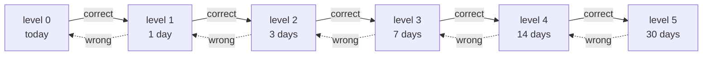

<div align="center">


# Fêrbûn

**Learn Kurdish, step by step.** Free, offline, no account.

<a href="https://omerizm47.github.io/ferbun/get.html"></a>


   

</div>

## Why it exists

Kurdish has tens of millions of speakers and almost no decent learning software. The apps that do exist want an account, a subscription, and a signal. Fêrbûn wants none of those. Every lesson, story and word ships inside the binary, so it works on a village bus with no coverage and on a phone that has never been signed in to anything.

## What is in it

The interface speaks **English or Turkish**, and that choice is separate from the variety you are learning.

| Track | Status | Content |
|---|---|---|
| **Kurmancî** (Latin script) | Complete | 3 courses, 10 units, 40 lessons, 292 words across 17 themes, 14 interactive stories |
| **Sorani** (Latin script) | In progress | Vocabulary and the first courses authored, remaining lessons registered as real empty lessons rather than crashes |

Lessons come in four shapes: `vocab`, `grammar`, `culture`, `reading`. Stories carry a gloss for every single word plus comprehension questions, so tapping an unknown word never breaks the reading.

## How the learning works

**Spaced repetition.** Each word carries a mastery level from 0 to 5. Getting it right pushes the next review out along a fixed ladder of 0, 1, 3, 7, 14 and 30 days. Getting it wrong drops it one rung, never all the way back to zero. The home screen derives a live "due now" count straight from that state, so there is no queue to rebuild and nothing to sync.



**Weak words.** Anything stuck at mastery 0 or 1 is available as its own flashcard deck, so you can drill what is actually failing without waiting for a timer to fire.

**Rapid fire.** A timed round for when you want pressure instead of patience.

**Streaks that mean something.** Consecutive days move you through Candle, Spark, Campfire, Bonfire and Newroz Fire at 3, 7, 14 and 30 days. 100 XP is a level. There is a daily XP goal that resets at midnight without a background timer, and 12 badges to find.

## Offline and private

There is no backend. There is no account. There is no analytics call.

Progress lives on the device in `AsyncStorage` under a versioned schema, with a migration path and a backup key, so an app update cannot quietly eat a 40 day streak. Turning the phone off aeroplane mode changes nothing about how the app behaves.

## Content provenance

Language content is not vibes. Taught Sorani entries cite a source declared in [`src/data/sources.ts`](src/data/sources.ts), currently Thackston's *Sorani Kurdish: A Reference Grammar with Selected Readings* (Harvard). Two checks run over the corpus:

```bash
npm run selfcheck          # structural integrity of the content tree
npm run verify-citations   # every citation locator resolves to a region the volume actually has
```

The citation check is deliberately honest about its own limits. It proves a locator is well formed and points inside a part of the book that exists. It does not prove the cited page says what the author claims, and it cannot tell you whether a form is idiomatic or current. That still needs a speaker.

## Running it locally

Requires Node.js 18+ and npm.

```bash
npm install
npm start           # Expo dev server
npm run android     # or: npm run ios
npm run typecheck
npm run lint
```

Builds are produced with EAS, configured in [`eas.json`](eas.json).

## Project layout

```
App.tsx                 Root: fonts, theme, navigation, providers
src/
  screens/              Home, Lesson, Unit, Flashcard, RapidFire,
                        StoriesList, Story, Vocab, Profile, Onboarding
  data/
    tracks.ts           Track registry: one entry per taught variety
    courses.ts          Kurmancî course tree
    vocabulary.ts       292 words, 17 themes
    stories.ts          14 stories with per-word glosses
    exercises.ts        Teach cards and exercises per lesson
    sources.ts          Provenance registry for cited content
    ckb/                The Sorani corpus, same shape
  stores/               zustand stores + AsyncStorage migration
  i18n/                 English and Turkish interface strings
  components/ hooks/ theme/ utils/
tools/                  Content self-check and citation verification
docs/                   GitHub Pages: download page, privacy policy
```

Adding a variety means adding an entry to the track registry, not teaching a screen a new id. Script is a stored field and is never inferred from the track id, so an Arabic-script Sorani is a second script on the same track rather than a fork of every screen.

## Links

[Download](https://omerizm47.github.io/ferbun/get.html) &nbsp;·&nbsp; [Privacy policy](https://omerizm47.github.io/ferbun/privacy-policy.html)
